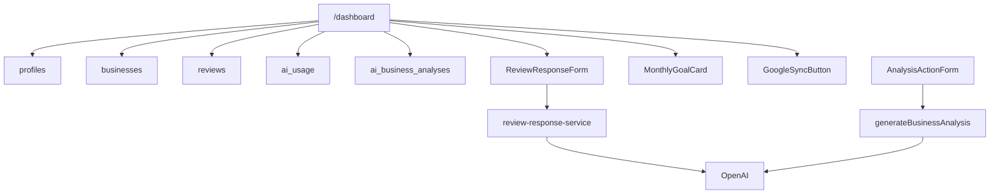

---
tags:
  - dashboard
  - mvp
  - openai
  - product
  - stripe
  - supabase
---

# Dashboard MVP

Dashboard jest głównym widokiem produktu po zalogowaniu. Kod znajduje się w `app/dashboard/page.tsx`.

## Dostęp

Dashboard wymaga:

- sesji Supabase Auth,
- profilu w `profiles`,
- firmy w `businesses`.

Jeżeli owner nie ma firmy, trafia do `/onboarding`.

Jeżeli plan to `unpaid`, dashboard pokazuje ekran aktywacji planu z przełącznikiem miesięcznie/rocznie i kartami Starter/Business.

## Layout

Desktop:

- sidebar po lewej,
- topbar,
- karty statystyk,
- karta „Limity planu”,
- date range picker w topbarze,
- wykres „Nowe opinie w czasie”,
- Business Insights dla planu Business,
- karta „Analiza ostatnich 30 dni”,
- sekcja „Najnowsze opinie klientów”.

Mobile:

- topbar z logo,
- pozioma nawigacja,
- sekcje układane pionowo.

## Sidebar

Linki:

- Pulpit,
- Opinie,
- Analiza,
- Odpowiedzi,
- Weryfikacja autora,
- NFC,
- Powiadomienia,
- Ustawienia.

Sidebar pokazuje nazwę firmy, branżę, miasto i plan.

## Statystyki

Źródło danych: `reviews`.

- **Nowe opinie**: liczba opinii w wybranym zakresie dat.
- **Średnia ocena**: `AVG(rating)` z dokładnością do 1 miejsca w wybranym zakresie.
- **Pozytywne opinie**: procent opinii `rating >= 4` w wybranym zakresie.
- **Skany NFC**: obecnie `0`, bez tabeli trackingowej.

## Limity planu

Źródła:

- `profiles.plan`,
- `ai_usage`,
- `lib/plans.ts`.

Karta pokazuje:

- pozostałe odpowiedzi na opinie,
- pozostałe analizy reputacji,
- procent wykorzystania,
- tekst „Wykorzystano X z Y”.

## Date Range Picker

Dashboard obsługuje wybór zakresu dat w `components/dashboard/trend-range-select.tsx`.

Dostępne opcje:

- Ostatnie 30 dni,
- Ostatnie 3 miesiące,
- Ostatnie 12 miesięcy,
- zakres niestandardowy `from` / `to` w query params.

Zakres wpływa na karty statystyk, wykres, Business Insights oraz listę najnowszych opinii.

## Wykres „Nowe opinie w czasie”

Źródło danych:

- `reviews.created_at`,
- `reviews.rating`.

Zakresy:

- ostatnie 30 dni: grupowanie po dniach,
- ostatnie 3 miesiące: grupowanie po tygodniach,
- ostatnie 12 miesięcy: grupowanie po miesiącach.

Wykres jest słupkowy i pokazuje liczbę opinii w okresie. Tooltip pokazuje okres, liczbę opinii i średnią ocenę. Okresy z `0` opinii są renderowane jako neutralne, minimalne słupki, aby oś czasu była ciągła.

## Business Insights

Widoczne tylko dla planu Business.

Liczone z `reviews.created_at`:

- najlepszy dzień w wybranym zakresie,
- **Ten miesiąc**: liczba opinii z bieżącego miesiąca i różnica względem poprzedniego miesiąca,
- **Cel miesiąca**: liczba opinii z bieżącego miesiąca względem `businesses.monthly_review_goal`.

Cel miesiąca jest edytowany inline w karcie `components/dashboard/monthly-goal-card.tsx`, bez modala. Walidacja: 1-1000 opinii.

## Analiza reputacji

Karta `components/dashboard/analysis-preview-card.tsx` pokazuje najnowszą analizę z `ai_business_analyses`.

Przycisk generowania/odświeżania korzysta z:

- `components/dashboard/analysis-action-form.tsx`,
- `generateBusinessAnalysis` w `app/dashboard/actions.ts`,
- `AiGenerationProgress`.

## Najnowsze opinie

Dashboard pobiera 3 najnowsze opinie firmy.

Karta opinii pokazuje:

- autora,
- datę relatywną,
- ocenę,
- treść,
- wygenerowaną odpowiedź, jeśli istnieje,
- przycisk „Kopiuj”, jeśli wygenerowana odpowiedź już istnieje,
- przycisk generowania odpowiedzi, jeśli limit nie jest wykorzystany.

Generowanie odpowiedzi używa `components/dashboard/review-response-form.tsx`.

Dashboard ma także przycisk „Synchronizuj z Google” w `components/dashboard/google-sync-button.tsx`. Obecnie działa jako mock przygotowany pod przyszłą integrację Google Business Profile API i zwraca `0` nowych opinii.

## Mapa techniczna

- **Odpowiedzialne pliki**: `app/dashboard/page.tsx`, `app/dashboard/actions.ts`, `app/dashboard/review-response-actions.ts`, `app/dashboard/review-response-service.ts`.
- **Komponenty**: `analysis-action-form`, `analysis-preview-card`, `review-response-form`, `trend-range-select`, `monthly-goal-card`, `google-sync-button`, `ai-generation-progress`.
- **Tabele**: `profiles`, `businesses`, `reviews`, `ai_usage`, `ai_review_responses`, `ai_business_analyses`, `business_response_settings`.

## Diagram

## Powiązane notatki

- [[Statystyki]]
- [[Opinie]]
- [[Odpowiedzi]]
- [[Analiza]]
- [[NFC]]
- [[Settings]]
- [[Server Actions]]
- [[Supabase]]
