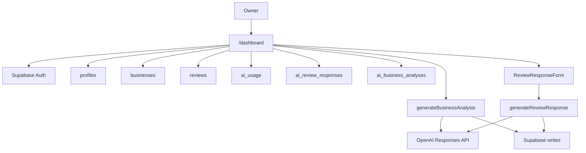

---
tags:
  - dashboard
  - mvp
  - openai
  - product
  - stripe
  - supabase
---

# Dashboard MVP

Dashboard jest głównym widokiem produktu po zalogowaniu. Aktualny kod znajduje się w `app/dashboard/page.tsx`.

Dashboard odpowiada na pytania:

- jaki plan ma użytkownik,
- jaka firma jest przypisana do ownera,
- ile opinii ma firma,
- jaka jest średnia ocena,
- jaki procent opinii jest pozytywny,
- ile limitów odpowiedzi i analiz pozostało,
- jakie są najnowsze opinie,
- czy istnieje wygenerowana analiza reputacji.

## Dostęp

Dashboard wymaga:

- aktywnej sesji Supabase Auth,
- istniejącego rekordu firmy w `public.businesses`,
- profilu użytkownika w `public.profiles`.

Jeżeli użytkownik nie ma firmy, `/dashboard` przekierowuje do `/onboarding`.

Jeżeli użytkownik ma plan `unpaid`, dashboard pokazuje ekran aktywacji planu zamiast pełnego panelu.

## Layout

Aktualny dashboard używa własnego shell layoutu w pliku `app/dashboard/page.tsx`.

Desktop:

- sidebar po lewej,
- topbar u góry,
- główna zawartość po prawej,
- karty statystyk,
- karta limitów planu,
- wykres trendu,
- karta analizy,
- sekcja najnowszych opinii.

Mobile:

- logo w topbarze,
- pozioma nawigacja pod topbarem,
- karty układane pionowo lub w responsywnej siatce.

## Sidebar

Sidebar pokazuje:

- logo NuvoRate,
- nazwę firmy,
- branżę,
- miasto,
- aktywny plan,
- linki: Pulpit, Opinie, Analiza, NFC,
- pozycje nieaktywne: Powiadomienia, Ustawienia,
- przycisk Stripe Customer Portal dla aktywnej subskrypcji,
- przycisk „Przejdź na Business” dla Startera bez aktywnego customer portal,
- wylogowanie.

## Widgety dashboardu

### Nowe opinie

Aktualnie pokazuje łączną liczbę opinii firmy z `public.reviews`. Nazwa „Nowe opinie” jest uproszczeniem UI; kod nie filtruje jeszcze po okresie.

### Średnia ocena

Średnia liczona z `reviews.rating`, formatowana do jednego miejsca po przecinku.

### Pozytywne opinie

Procent opinii z `rating >= 4`.

### Skany NFC

Aktualnie wartość `0`, bez podłączenia do tabeli skanów. UI używa tekstu „Śledzenie NFC”.

## Limity planu

Karta „Limity planu” pokazuje:

- odpowiedzi na opinie: pozostało, procent i wykorzystanie,
- analizy reputacji: pozostało, procent i wykorzystanie,
- plan użytkownika.

Dane pochodzą z:

- `profiles.plan`,
- `ai_usage.ai_replies_used`,
- `ai_usage.ai_analyses_used`,
- `lib/plans.ts`.

Jeżeli nie ma rekordu w `ai_usage`, UI przyjmuje użycie `0`.

## Komunikaty limitów

Komunikaty backendowe są definiowane w `lib/plans.ts`.

Aktualne komunikaty:

- Unpaid: „Wybierz plan, aby korzystać z odpowiedzi na opinie i analiz reputacji.”
- Starter, analiza: „Wykorzystałeś analizę reputacji w planie Starter. Przejdź na Business, aby odblokować więcej analiz.”
- Starter, odpowiedzi: „Wykorzystałeś limit odpowiedzi na opinie w planie Starter.”
- Business, odpowiedzi: „Osiągnięto miesięczny limit odpowiedzi na opinie. Limit odnowi się w kolejnym okresie rozliczeniowym.”
- Business, analizy: „Osiągnięto miesięczny limit analiz reputacji. Limit odnowi się w kolejnym okresie rozliczeniowym.”
- Oba limity: „Wszystkie odpowiedzi na opinie i analizy reputacji zostały wykorzystane. Limity odnowią się w kolejnym okresie rozliczeniowym.”

## Analiza reputacji

Dashboard pokazuje najnowszą analizę z `public.ai_business_analyses`.

Jeżeli analiza istnieje, UI pokazuje:

- podsumowanie,
- najczęściej chwalone elementy,
- najczęściej zgłaszane problemy,
- rekomendacje działań,
- liczbę opinii wykorzystanych w analizie,
- datę wygenerowania.

Przycisk „Wygeneruj analizę” lub „Odśwież analizę” wywołuje `generateBusinessAnalysis`.

## Trend opinii

Wykres „Trend reputacji” jest aktualnie statycznym SVG. Nie korzysta jeszcze z agregacji opinii z Supabase.

## Ostatnie opinie

Dashboard pobiera 3 najnowsze opinie firmy i pokazuje:

- autora,
- relatywną datę,
- ocenę,
- treść,
- wygenerowaną odpowiedź, jeśli istnieje,
- przycisk generowania lub ponownego generowania odpowiedzi.

Jeżeli limit odpowiedzi jest wykorzystany, zamiast przycisku pojawia się:

> Limit odpowiedzi wykorzystany

## Server Actions używane przez dashboard

- `signOut` z `app/dashboard/actions.ts`
- `generateBusinessAnalysis` z `app/dashboard/actions.ts`
- `generateReviewResponse` z `app/dashboard/review-response-actions.ts`
- implementacja odpowiedzi: `app/dashboard/review-response-service.ts`

## Mapa techniczna

- **Odpowiedzialne pliki**: `app/dashboard/page.tsx`, `app/dashboard/actions.ts`, `app/dashboard/review-response-actions.ts`, `app/dashboard/review-response-service.ts`.
- **Komponenty**: `components/dashboard/review-response-form.tsx`, `components/dashboard/review-response-state.ts`.
- **Używane tabele**: `profiles`, `businesses`, `reviews`, `ai_usage`, `ai_review_responses`, `ai_business_analyses`.
- **Server actions**: `signOut`, `generateBusinessAnalysis`, `generateReviewResponse`.
- **Route handlers**: `app/billing/portal/route.ts` dla przycisku zarządzania subskrypcją, `app/checkout/route.ts` dla przejścia na plan.
- **Zależności**: [[Supabase]], [[OpenAI]], [[Stripe]], [[Frontend]], [[Server Actions]].

## Diagram przepływu dashboardu

## Powiązane notatki

- [[Statystyki]]
- [[Opinie]]
- [[Analiza]]
- [[NFC]]
- [[Server Actions]]
- [[Supabase]]
- [[Dashboard MOC]]
