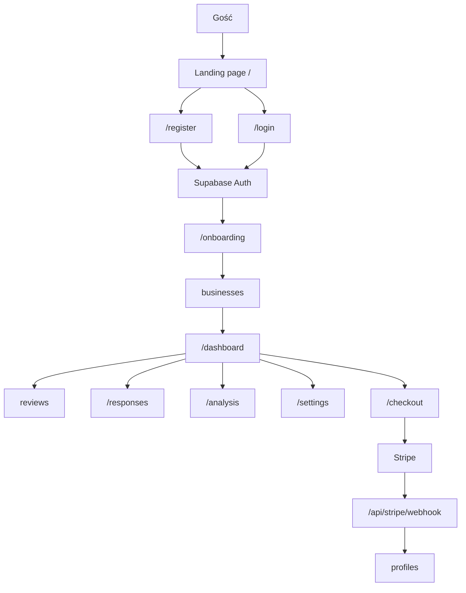
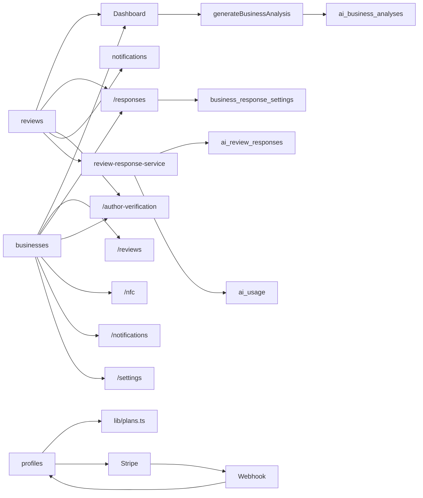

---
tags:
  - architecture
  - backend
  - development
  - frontend
  - nextjs
---

# Architektura

NuvoRate jest aplikacją Next.js App Router z Supabase Auth, Supabase Database, Stripe Subscriptions, OpenAI Responses API i Tailwind CSS.

## Główne warstwy

- **Next.js 15 App Router**: strony, route handlers, server actions, server components i client components.
- **Supabase Auth**: logowanie, rejestracja, reset hasła, sesje.
- **Supabase Database**: profile, firmy, opinie, odpowiedzi, analizy, limity i ustawienia.
- **Stripe**: Checkout, webhook, Customer Portal, plany miesięczne i roczne.
- **OpenAI**: Structured Outputs dla odpowiedzi i analiz reputacji.
- **Tailwind CSS**: landing page, auth screens i dashboard shell.

## Aktualne strony aplikacji

- `/`: landing page z cennikiem miesięcznym/rocznym.
- `/register`, `/login`, `/forgot-password`, `/update-password`: auth.
- `/onboarding`: dane firmy.
- `/dashboard`: główny pulpit.
- `/reviews`: lista opinii z filtrem i paginacją.
- `/responses`: zarządzanie odpowiedziami.
- `/author-verification`: weryfikacja autora jako Business Feature przygotowana pod Google.
- `/analysis`: pełna analiza reputacji.
- `/nfc`: link Google review URL i instrukcja NFC.
- `/notifications`: historia powiadomień o nowych opiniach.
- `/settings`: nazwa firmy, branża, styl odpowiedzi, konto i plan.
- `/checkout`: Stripe Checkout.
- `/billing/portal`: Stripe Customer Portal.

## Route handlers

- `app/checkout/route.ts`: tworzy Stripe Checkout Session.
- `app/billing/portal/route.ts`: tworzy Stripe Billing Portal Session.
- `app/api/stripe/webhook/route.ts`: synchronizuje Stripe z `profiles`.
- `app/api/responses/generate/route.ts`: generuje odpowiedź dla `/responses`.
- `app/api/responses/auto-generate/route.ts`: generuje odpowiedzi po zapisie ustawień automatu.
- `app/api/responses/settings/route.ts`: zapisuje ustawienia automatycznych odpowiedzi.
- `app/api/responses/[id]/route.ts`: zapisuje/edytuje odpowiedź.
- `app/api/responses/[id]/responded/route.ts`: oznacza odpowiedź jako `responded`.
- `app/api/notifications/[id]/read/route.ts`: oznacza pojedyncze powiadomienie jako przeczytane.
- `app/api/notifications/read-all/route.ts`: oznacza wszystkie powiadomienia typu `new_review` jako przeczytane.
- `app/auth/callback/route.ts`: callback Supabase Auth.

## Server/client boundary

- Kod z service role (`createAdminClient`) działa wyłącznie server-side.
- Odpowiedzi z dashboardu używają `app/dashboard/review-response-actions.ts`, który wywołuje server-only service `app/dashboard/review-response-service.ts`.
- Analiza reputacji używa kontrolowanego client form `components/dashboard/analysis-action-form.tsx`, który wywołuje server action `generateBusinessAnalysis`.
- Wspólne komponenty UI: `AiGenerationProgress` i `Pagination`.

## Diagram przepływu aplikacji

## Diagram modułów

## Powiązane notatki

- [[Frontend]]
- [[Backend]]
- [[Server Actions]]
- [[Supabase]]
- [[Stripe]]
- [[OpenAI]]
- [[Deployment]]
