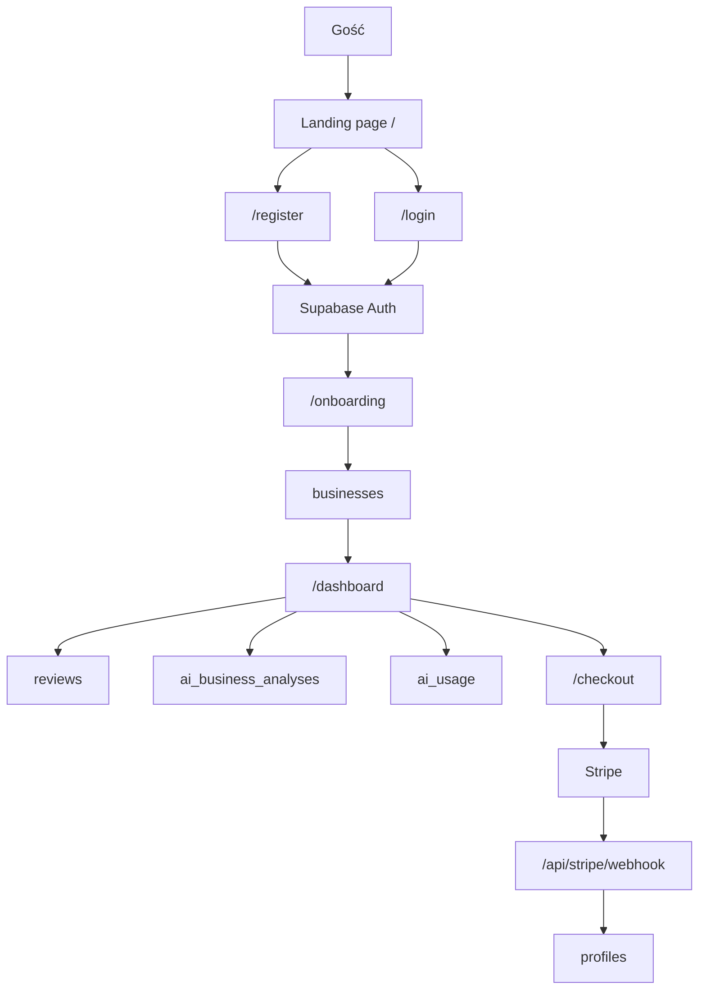
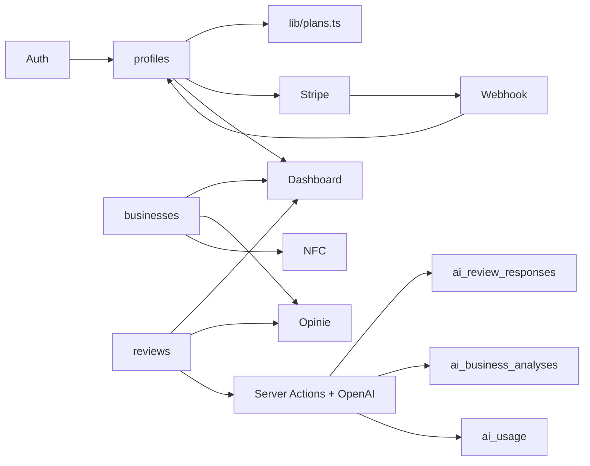

---
tags:
  - architecture
  - backend
  - development
  - frontend
  - moc
---

# Architektura

NuvoRate jest aplikacją Next.js App Router z backendem Supabase, billingiem Stripe i integracją OpenAI.

## Główne warstwy

- **Next.js App Router**: strony, route handlers i server actions.
- **Supabase Auth**: sesje użytkowników.
- **Supabase Database**: dane aplikacyjne.
- **Stripe**: subskrypcje i portal klienta.
- **OpenAI**: generowanie odpowiedzi i analiz reputacji.
- **Tailwind CSS**: warstwa UI.

## Diagram przepływu aplikacji

## Diagram modułów

## Server/client boundary

Szczególnie ważne jest rozdzielenie server actions od client components.

- Client component `ReviewResponseForm` importuje action-browser wrapper `app/dashboard/review-response-actions.ts`.
- Wrapper wywołuje server-only implementację `app/dashboard/review-response-service.ts`.
- Nie należy przekazywać server action jako prop do client componentu.
- Nie należy importować głównego `app/dashboard/actions.ts` bezpośrednio do client componentów.

## Powiązane notatki

- [[Frontend]]
- [[Backend]]
- [[Server Actions]]
- [[Supabase]]
- [[Stripe]]
- [[OpenAI]]
- [[Development MOC]]
