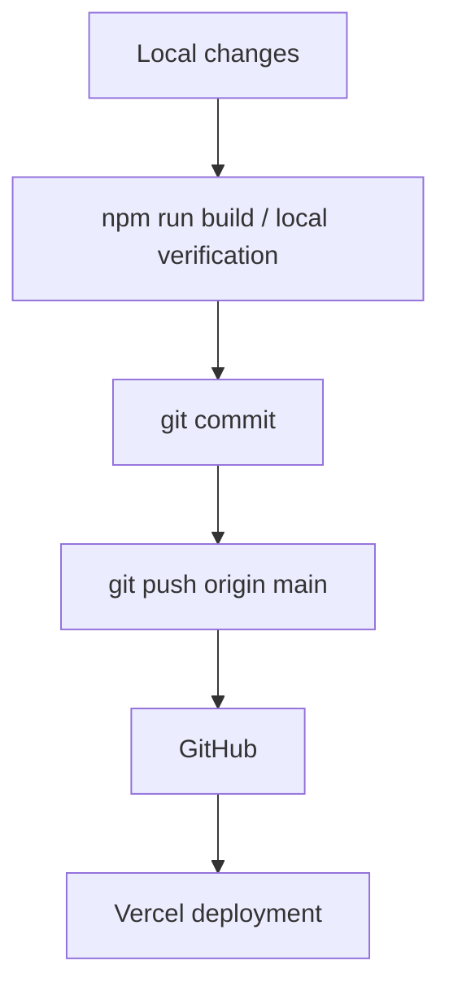

---
tags:
  - deployment
  - development
  - github
  - vercel
---

# Deployment

NuvoRate jest wersjonowane w GitHub i deployowane przez Vercel.

## Repozytorium

Remote:

- `git@github.com:FabianDziekan/Nuvorate.git`

Główna gałąź:

- `main`

Ostatnie prace były commitowane i pushowane na `main`.

## Vercel

Vercel buduje aplikację Next.js z repozytorium GitHub.

Ważne:

- projekt ma `pnpm-lock.yaml`,
- Vercel wykrywa pnpm i wymaga synchronizacji `package.json` z `pnpm-lock.yaml`,
- po dodaniu `stripe` konieczna była aktualizacja lockfile przez `pnpm install`,
- nie należy ręcznie edytować lockfile.

## Package manager

Aktualnie repo zawiera:

- `package.json`
- `pnpm-lock.yaml`
- `package-lock.json`

Problem deploymentu `ERR_PNPM_OUTDATED_LOCKFILE` rozwiązuje aktualizacja `pnpm-lock.yaml`.

## Env wymagane na Vercel

Supabase:

- `NEXT_PUBLIC_SUPABASE_URL`
- `NEXT_PUBLIC_SUPABASE_ANON_KEY`
- `SUPABASE_SERVICE_ROLE_KEY`

Stripe:

- `STRIPE_SECRET_KEY`
- `STRIPE_WEBHOOK_SECRET`
- `STRIPE_STARTER_PRICE_ID`
- `STRIPE_BUSINESS_PRICE_ID`
- `STRIPE_STARTER_YEARLY_PRICE_ID` opcjonalnie
- `STRIPE_BUSINESS_YEARLY_PRICE_ID` opcjonalnie
- `NEXT_PUBLIC_APP_URL`

OpenAI:

- `OPENAI_API_KEY`
- `OPENAI_MODEL` opcjonalnie

## Workflow

## Przed publicznym SaaS

Przed publicznym uruchomieniem płatnej wersji NuvoRate trzeba przygotować i podlinkować dokumenty opisane w [[Dokumenty prawne SaaS]]:

- regulamin usługi,
- politykę prywatności,
- politykę cookies,
- dane kontaktowe operatora.

## Ostatnia poprawka deploymentu

Problem:

- `ERR_PNPM_OUTDATED_LOCKFILE`

Rozwiązanie:

- uruchomiono `pnpm install`,
- zacommitowano zaktualizowany `pnpm-lock.yaml`,
- push na GitHub.

## Powiązane notatki

- [[Architektura]]
- [[Backend]]
- [[Stripe]]
- [[Supabase]]
- [[Dokumenty prawne SaaS]]
