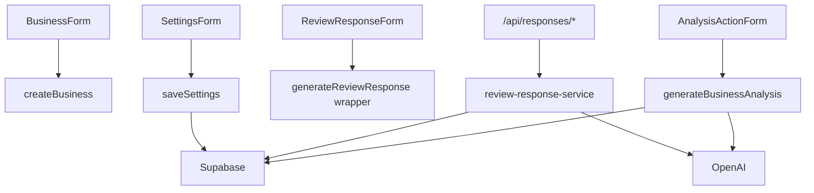

---
tags:
  - backend
  - development
  - server-actions
---

# Server Actions

Server Actions obsługują operacje wymagające sesji użytkownika, walidacji i zapisu do Supabase.

## `createBusiness`

Lokalizacja:

- `app/onboarding/actions.ts`

Wywoływana przez:

- `components/onboarding/business-form.tsx`

Tworzy rekord w `businesses` dla aktualnego ownera. Jeden owner = jedna firma.

## `signOut`

Lokalizacja:

- `app/dashboard/actions.ts`

Wywoływana przez:

- dashboard shell na `/dashboard`, `/reviews`, `/responses`, `/analysis`, `/nfc`, `/settings`.

Kończy sesję Supabase i przekierowuje do `/login`.

## `generateBusinessAnalysis`

Lokalizacja:

- `app/dashboard/actions.ts`

Wywoływana przez:

- `components/dashboard/analysis-action-form.tsx`
- dashboard,
- `/analysis`.

Robi:

1. Pobiera użytkownika, firmę i profil.
2. Sprawdza limit analiz w `ai_usage`.
3. Pobiera opinie z ostatnich 30 dni.
4. Wysyła dane do OpenAI.
5. Zapisuje rekord w `ai_business_analyses`.
6. Zwiększa `ai_usage.ai_analyses_used`.
7. Rewaliduje `/dashboard` i `/analysis`.

## `generateReviewResponse`

Lokalizacja wrappera:

- `app/dashboard/review-response-actions.ts`

Implementacja:

- `app/dashboard/review-response-service.ts`

Wywoływana przez:

- `components/dashboard/review-response-form.tsx`
- route handlers `/api/responses/generate` i `/api/responses/auto-generate`.

Robi:

1. Pobiera użytkownika i plan.
2. Sprawdza limit odpowiedzi.
3. Pobiera firmę i opinię.
4. Pobiera `business_response_settings.response_tone`.
5. Wysyła dane do OpenAI.
6. Zapisuje `ai_review_responses`.
7. Synchronizuje pola odpowiedzi w `reviews`.
8. Zwiększa `ai_usage.ai_replies_used`.
9. Rewaliduje `/dashboard` i `/responses`.

## `saveSettings`

Lokalizacja:

- `app/settings/actions.ts`

Wywoływana przez:

- `components/settings/settings-form.tsx`

Zapisuje:

- `businesses.name`
- `businesses.industry`
- `business_response_settings.response_tone`

## Route handlers zamiast Server Actions

Moduł `/responses` korzysta głównie z route handlers, żeby aktualizować lokalny stan React bez pełnego odświeżenia strony:

- `POST /api/responses/generate`
- `POST /api/responses/auto-generate`
- `PATCH /api/responses/settings`
- `PATCH /api/responses/[id]`
- `POST /api/responses/[id]/responded`

Stripe działa wyłącznie przez route handlers:

- `/checkout`
- `/billing/portal`
- `/api/stripe/webhook`

## Diagram

## Powiązane notatki

- [[Dashboard MVP]]
- [[Odpowiedzi]]
- [[Settings]]
- [[OpenAI]]
- [[Supabase]]
