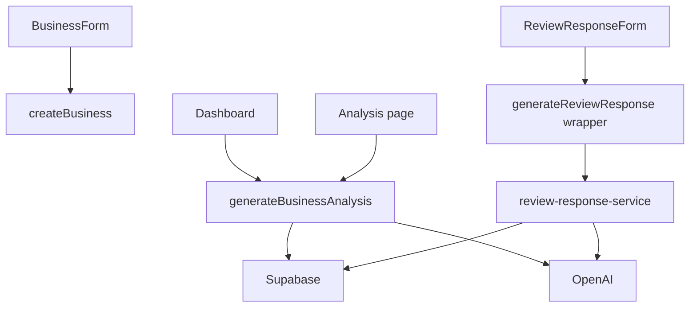

---
tags:
  - backend
  - development
  - server-actions
---

# Server Actions

Server Actions obsługują operacje wymagające sesji użytkownika i zapisu do Supabase.

## `createBusiness`

Lokalizacja:

- `app/onboarding/actions.ts`

Wywoływana przez:

- `components/onboarding/business-form.tsx`

Co robi:

- waliduje nazwę firmy, branżę, miasto i Google review URL,
- pobiera aktualnego użytkownika,
- sprawdza, czy owner ma już firmę,
- tworzy rekord w `public.businesses`,
- ustawia `setup_status = completed`,
- przekierowuje do `/dashboard`.

Zapisuje dane:

- `businesses.owner_id`,
- `businesses.name`,
- `businesses.industry`,
- `businesses.city`,
- `businesses.google_review_url`,
- `businesses.setup_status`.

Limity planów:

- nie korzysta z limitów planów.

## `signOut`

Lokalizacja:

- `app/dashboard/actions.ts`

Wywoływana przez:

- `/dashboard`,
- `/reviews`,
- `/analysis`,
- `/nfc`.

Co robi:

- wylogowuje użytkownika przez Supabase Auth,
- przekierowuje do `/login`.

Zapisuje dane:

- nie zapisuje danych biznesowych.

Limity planów:

- nie korzysta z limitów.

## `generateBusinessAnalysis`

Lokalizacja:

- `app/dashboard/actions.ts`

Wywoływana przez:

- formularz w `/dashboard`,
- formularz w `/analysis`.

Co robi:

- pobiera użytkownika, firmę i profil,
- sprawdza limit analiz w `ai_usage`,
- pobiera opinie z ostatnich 30 dni,
- wysyła dane do OpenAI,
- waliduje `score` i `trend`,
- zapisuje analizę w `ai_business_analyses`,
- zwiększa `ai_analyses_used`,
- odświeża `/dashboard` i `/analysis`.

Zapisuje dane:

- `ai_business_analyses`,
- `ai_usage.ai_analyses_used`.

Limity planów:

- unpaid: 0,
- starter: 1 analiza miesięcznie,
- business: 50 analiz miesięcznie.

## `generateReviewResponse`

Lokalizacja action-browser:

- `app/dashboard/review-response-actions.ts`

Implementacja:

- `app/dashboard/review-response-service.ts`

Wywoływana przez:

- `components/dashboard/review-response-form.tsx`

Co robi:

- pobiera użytkownika,
- pobiera plan z `profiles`,
- sprawdza limit odpowiedzi,
- pobiera firmę i opinię,
- wysyła dane opinii do OpenAI,
- zapisuje odpowiedź w `ai_review_responses`,
- zwiększa `ai_replies_used`,
- odświeża `/dashboard`.

Zapisuje dane:

- `ai_review_responses.response_text`,
- `ai_review_responses.model`,
- `ai_usage.ai_replies_used`.

Limity planów:

- unpaid: 0,
- starter: 50 odpowiedzi miesięcznie,
- business: 350 odpowiedzi miesięcznie.

Ważna zasada architektoniczna:

- server action nie jest przekazywana jako prop do client componentu,
- client component importuje bezpieczny wrapper `review-response-actions.ts`,
- wrapper wywołuje server-only service.

## Diagram Server Actions

## Mapa odpowiedzialności

- **Onboarding firmy**: `createBusiness` tworzy `businesses`.
- **Sesja**: `signOut` kończy sesję Supabase.
- **Analiza reputacji**: `generateBusinessAnalysis` używa `reviews`, `ai_usage`, `ai_business_analyses` i OpenAI.
- **Odpowiedzi na opinie**: `generateReviewResponse` używa `reviews`, `ai_usage`, `ai_review_responses` i OpenAI.
- **Limity planów**: akcje generujące korzystają z konfiguracji w `lib/plans.ts`.
- **Service role**: zapisy liczników i danych generowanych po stronie serwera nie powinny trafiać do komponentów klientowych.

## Powiązane notatki

- [[Dashboard MVP]]
- [[Opinie]]
- [[Analiza]]
- [[Supabase]]
- [[OpenAI]]
- [[Development MOC]]
