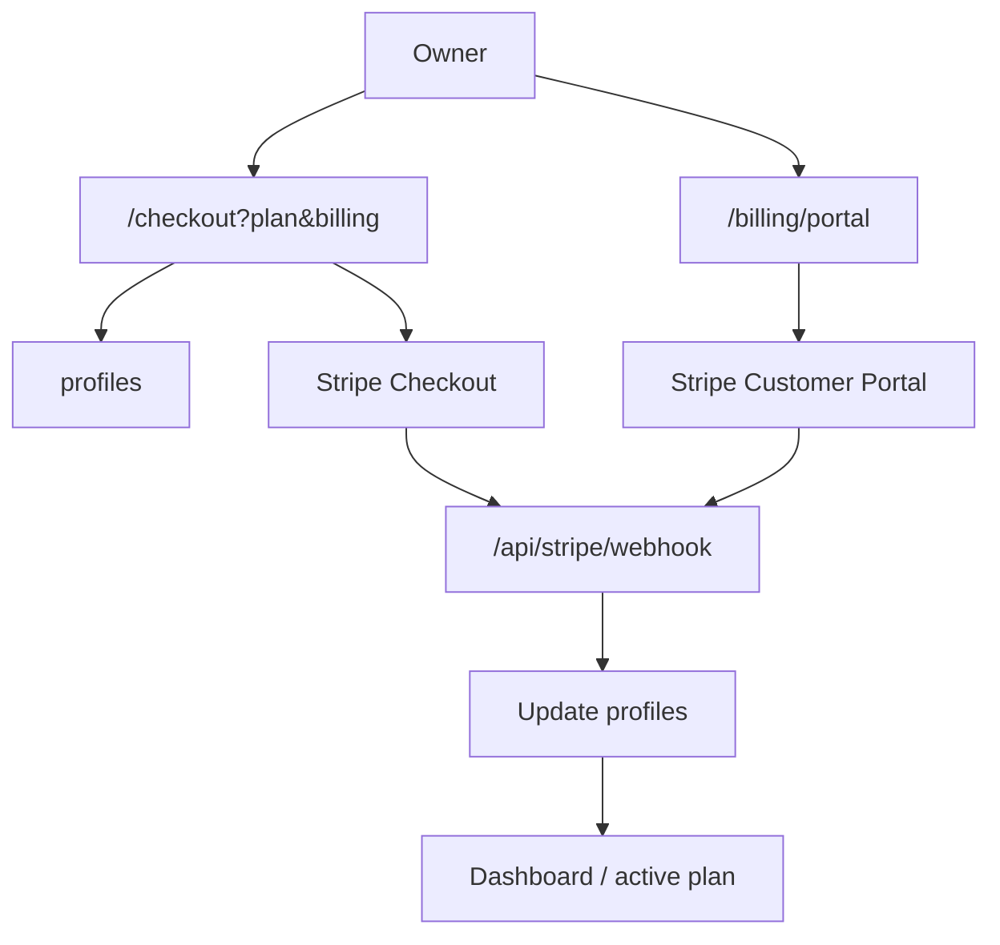

---
tags:
  - backend
  - billing
  - development
  - stripe
---

# Stripe

Stripe obsługuje subskrypcje Starter i Business. Webhook Stripe jest źródłem prawdy dla `profiles.plan`.

## Plany i ceny

Starter:

- 49,99 zł miesięcznie,
- 499,99 zł rocznie.

Business:

- 229,99 zł miesięcznie,
- 2299,99 zł rocznie.

Limity planów nie zależą od cyklu rozliczenia.

## Env

Wymagane:

- `STRIPE_SECRET_KEY`
- `STRIPE_WEBHOOK_SECRET`
- `STRIPE_STARTER_PRICE_ID`
- `STRIPE_BUSINESS_PRICE_ID`
- `NEXT_PUBLIC_APP_URL`

Opcjonalne dla rocznych checkoutów:

- `STRIPE_STARTER_YEARLY_PRICE_ID`
- `STRIPE_BUSINESS_YEARLY_PRICE_ID`

Jeżeli roczny Price ID nie jest ustawiony, UI może pokazać cenę roczną, ale checkout dla tego wariantu jest blokowany kontrolowanym błędem.

## Checkout

Route handler:

- `app/checkout/route.ts`

Parametry:

- `plan=starter|business`
- `billing=monthly|yearly`

Przepływ:

1. Waliduje plan i cykl rozliczenia.
2. Sprawdza, czy Price ID istnieje.
3. Pobiera sesję Supabase.
4. Pobiera profil użytkownika.
5. Tworzy Stripe Customer, jeśli go brakuje.
6. Zapisuje `stripe_customer_id` w `profiles`.
7. Tworzy Checkout Session `mode=subscription`.
8. Dodaje metadata: `user_id`, `plan`, `billing_cycle`.
9. Przekierowuje do Stripe.

`success_url` prowadzi do `/dashboard?checkout=success`, ale nie aktywuje planu. Aktywacja następuje tylko przez webhook.

## Webhook

Route handler:

- `app/api/stripe/webhook/route.ts`

Obsługiwane eventy:

- `checkout.session.completed`
- `checkout.session.expired`
- `customer.subscription.created`
- `customer.subscription.updated`
- `customer.subscription.deleted`
- `invoice.payment_succeeded`
- `invoice.payment_failed`

Webhook aktualizuje:

- `profiles.plan`
- `profiles.stripe_customer_id`
- `profiles.stripe_subscription_id`
- `profiles.subscription_status`
- `profiles.current_period_end`

Statusy `canceled`, `unpaid`, `incomplete_expired` ustawiają `profiles.plan = unpaid`.

## Mapowanie price ID

Funkcja:

- `getPlanFromPriceId()` w `lib/stripe.ts`

Mapuje miesięczne i roczne Price ID na ten sam plan:

- Starter monthly/yearly -> `starter`
- Business monthly/yearly -> `business`

## Customer Portal

Route handler:

- `app/billing/portal/route.ts`

Wymaga:

- zalogowanego użytkownika,
- `profiles.stripe_customer_id`.

Tworzy Stripe Billing Portal Session i wraca do `/dashboard`.

## Pliki

- `lib/stripe.ts`
- `app/checkout/route.ts`
- `app/api/stripe/webhook/route.ts`
- `app/billing/portal/route.ts`
- `components/billing/plan-picker.tsx`
- `components/billing/checkout-activation-status.tsx`
- `lib/pricing.ts`

## Diagram

## Powiązane notatki

- [[Starter]]
- [[Business]]
- [[Cennik]]
- [[Supabase]]
- [[Deployment]]
