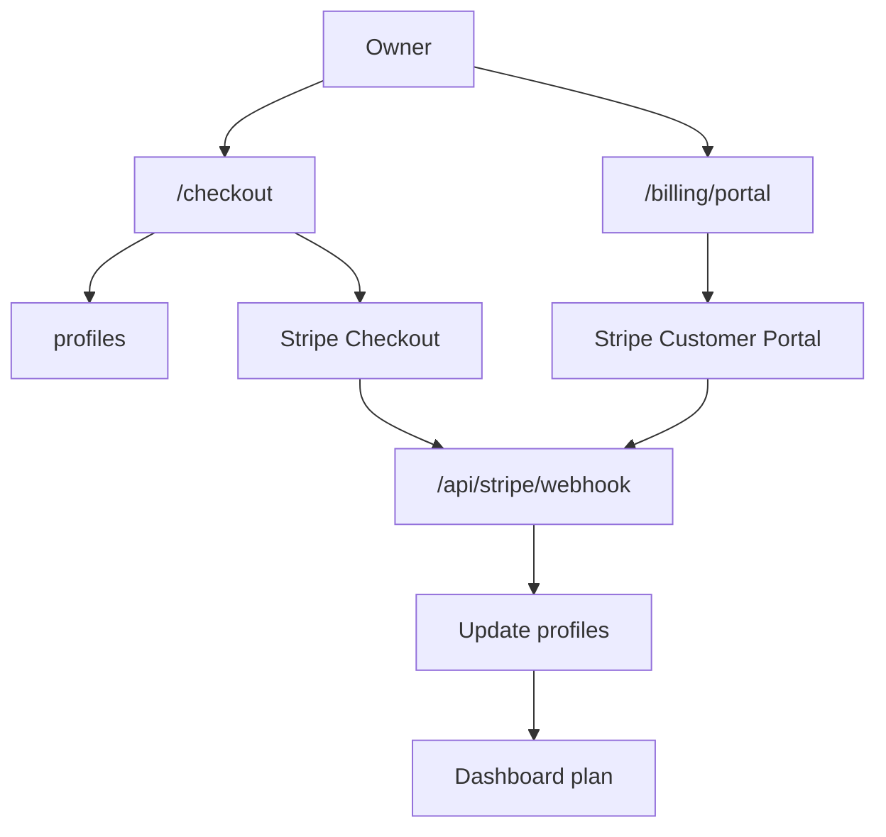

---
tags:
  - backend
  - billing
  - development
  - stripe
---

# Stripe

Stripe obsługuje subskrypcje planów Starter i Business. Webhook Stripe jest źródłem prawdy dla zmiany planu w `public.profiles`.

## Plany

- Starter: 49,99 zł miesięcznie.
- Business: 229,99 zł miesięcznie.

Price IDs są pobierane ze zmiennych:

- `STRIPE_STARTER_PRICE_ID`,
- `STRIPE_BUSINESS_PRICE_ID`.

## Checkout

Route handler:

- `app/checkout/route.ts`

Przepływ:

1. Użytkownik wchodzi na `/checkout?plan=starter` albo `/checkout?plan=business`.
2. Route sprawdza sesję Supabase.
3. Pobiera profil użytkownika.
4. Jeżeli profil nie ma `stripe_customer_id`, tworzy Stripe Customer.
5. Zapisuje `stripe_customer_id` do `profiles`.
6. Tworzy Stripe Checkout Session w trybie `subscription`.
7. Dodaje metadata:
   - `user_id`,
   - `plan`.
8. Przekierowuje użytkownika do Stripe.

Ważne: powrót na `success_url` nie aktywuje planu. Plan zmienia webhook.

## Webhook

Route handler:

- `app/api/stripe/webhook/route.ts`

Obsługiwane eventy:

- `checkout.session.completed`,
- `checkout.session.expired`,
- `customer.subscription.created`,
- `customer.subscription.updated`,
- `customer.subscription.deleted`,
- `invoice.payment_succeeded`,
- `invoice.payment_failed`.

Webhook aktualizuje:

- `profiles.plan`,
- `profiles.stripe_customer_id`,
- `profiles.stripe_subscription_id`,
- `profiles.subscription_status`,
- `profiles.current_period_end`.

## Anulowanie i brak płatności

Statusy:

- `canceled`,
- `unpaid`,
- `incomplete_expired`

ustawiają:

- `profiles.plan = unpaid`.

`customer.subscription.deleted` nie rzuca błędu 500, jeżeli testowy customer ze Stripe CLI nie istnieje w `profiles`; event jest ignorowany z `console.warn`.

## Customer Portal

Route handler:

- `app/billing/portal/route.ts`

Wymaga:

- zalogowanego użytkownika,
- `profiles.stripe_customer_id`.

Tworzy Stripe Billing Portal Session i przekierowuje użytkownika do Stripe.

## Mapa techniczna

- **Odpowiedzialne pliki**: `app/checkout/route.ts`, `app/api/stripe/webhook/route.ts`, `app/billing/portal/route.ts`, `lib/stripe.ts`.
- **Używane tabele**: `profiles`.
- **Server actions**: brak; integracja Stripe działa przez route handlers.
- **Route handlers**: `/checkout`, `/api/stripe/webhook`, `/billing/portal`.
- **Zależności**: Stripe API, Supabase service role, `STRIPE_SECRET_KEY`, `STRIPE_WEBHOOK_SECRET`, `STRIPE_STARTER_PRICE_ID`, `STRIPE_BUSINESS_PRICE_ID`, `NEXT_PUBLIC_APP_URL`.
- **Dokumenty źródłowe cen i limitów**: [[Cennik]], [[Starter]], [[Business]].

## Helper Stripe

Plik:

- `lib/stripe.ts`

Zawiera:

- walidację envów,
- tworzenie customer,
- tworzenie checkout session,
- tworzenie portal session,
- pobieranie subskrypcji,
- ręczną weryfikację podpisu webhooka przez HMAC.

## Diagram

## Powiązane notatki

- [[Starter]]
- [[Business]]
- [[Supabase]]
- [[Backend]]
- [[Roadmap]]
- [[Development MOC]]
