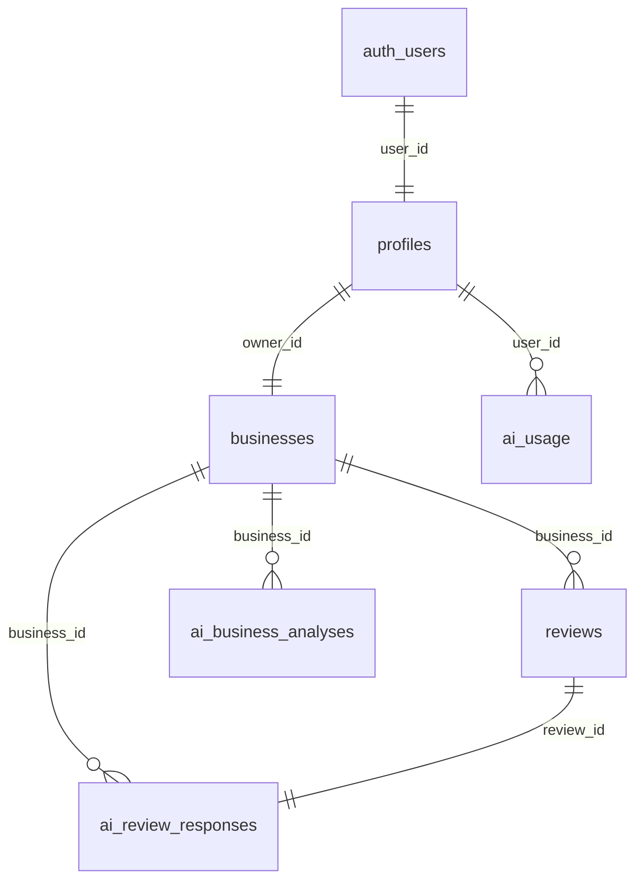

---
tags:
  - backend
  - database
  - development
  - supabase
---

# Supabase

Supabase obsługuje autoryzację, sesje i bazę danych NuvoRate.

## Klienci Supabase w kodzie

- `lib/supabase/server.ts`: klient SSR używany w Server Components, actions i route handlers.
- `lib/supabase/client.ts`: klient browserowy.
- `lib/supabase/admin.ts`: service role, tylko server-side.
- `lib/supabase/middleware.ts`: odświeżanie sesji i ochrona tras.

## Tabele

### `profiles`

Przeznaczenie: profil ownera powiązany z `auth.users`.

Najważniejsze kolumny:

- `user_id`: primary key, references `auth.users(id)`,
- `full_name`,
- `plan`: `unpaid`, `starter`, `business`,
- `stripe_customer_id`,
- `stripe_subscription_id`,
- `subscription_status`,
- `current_period_end`,
- `created_at`,
- `updated_at`.

Wykorzystanie:

- dashboard,
- onboarding,
- reviews,
- analysis,
- nfc,
- checkout,
- billing portal,
- Stripe webhook,
- limity planów.

### `businesses`

Przeznaczenie: jedna firma przypisana do ownera.

Najważniejsze kolumny:

- `id`,
- `owner_id`: references `profiles.user_id`, unique,
- `name`,
- `industry`,
- `city`,
- `google_review_url`,
- `setup_status`,
- `created_at`,
- `updated_at`.

Wykorzystanie:

- onboarding zapisuje rekord,
- dashboard pobiera dane firmy,
- reviews filtruje opinie po `business.id`,
- analysis filtruje analizy po `business.id`,
- nfc pokazuje Google review URL.

### `reviews`

Przeznaczenie: opinie klientów przypisane do firmy.

Najważniejsze kolumny:

- `id`,
- `business_id`: references `businesses.id`,
- `author_name`,
- `rating`,
- `content`,
- `source`,
- `created_at`.

Wykorzystanie:

- dashboard: 3 najnowsze opinie i statystyki,
- `/reviews`: pełna lista,
- generowanie odpowiedzi,
- analiza reputacji.

### `ai_review_responses`

Przeznaczenie: wygenerowane odpowiedzi na pojedyncze opinie.

Najważniejsze kolumny:

- `id`,
- `business_id`,
- `review_id`: unique, references `reviews.id`,
- `response_text`,
- `model`,
- `created_at`,
- `updated_at`.

Wykorzystanie:

- dashboard pokazuje odpowiedź przy opinii,
- generowanie odpowiedzi robi `upsert` po `review_id`.

### `ai_business_analyses`

Przeznaczenie: zapisane analizy reputacji firmy.

Najważniejsze kolumny:

- `id`,
- `business_id`,
- `period_start`,
- `period_end`,
- `review_count`,
- `score`,
- `trend`,
- `summary`,
- `praised_elements`,
- `reported_problems`,
- `recommendations`,
- `model`,
- `created_at`,
- `updated_at`.

Wykorzystanie:

- dashboard pokazuje najnowszą analizę,
- `/analysis` pokazuje pełny raport,
- `generateBusinessAnalysis` zapisuje nowy rekord.

### `ai_usage`

Przeznaczenie: miesięczne liczniki limitów planu.

Najważniejsze kolumny:

- `id`,
- `user_id`: references `profiles.user_id`,
- `period_month`,
- `ai_replies_used`,
- `ai_analyses_used`,
- `created_at`,
- `updated_at`.

Unikalność:

- `user_id + period_month`.

Wykorzystanie:

- dashboard karta „Limity planu”,
- generowanie odpowiedzi,
- generowanie analiz.

## RLS

Migracje włączają RLS dla tabel publicznych. Owner może czytać i edytować własne dane. Część zapisów krytycznych, np. Stripe i liczniki, używa service role po stronie server.

## Mapa zależności tabel

## Migracje

- `001_initial_schema.sql`: profiles, businesses.
- `002_reviews.sql`: reviews i demo seed.
- `003_ai_features.sql`: ai_review_responses, ai_business_analyses.
- `004_business_analysis_score_trend.sql`: score i trend.
- `005_stripe_subscriptions.sql`: pola Stripe w profiles.
- `006_unpaid_plan_ai_usage.sql`: plan unpaid i ai_usage.

## Powiązane notatki

- [[Backend]]
- [[Server Actions]]
- [[Autoryzacja]]
- [[Stripe]]
- [[OpenAI]]
- [[Dashboard MOC]]
- [[Development MOC]]
