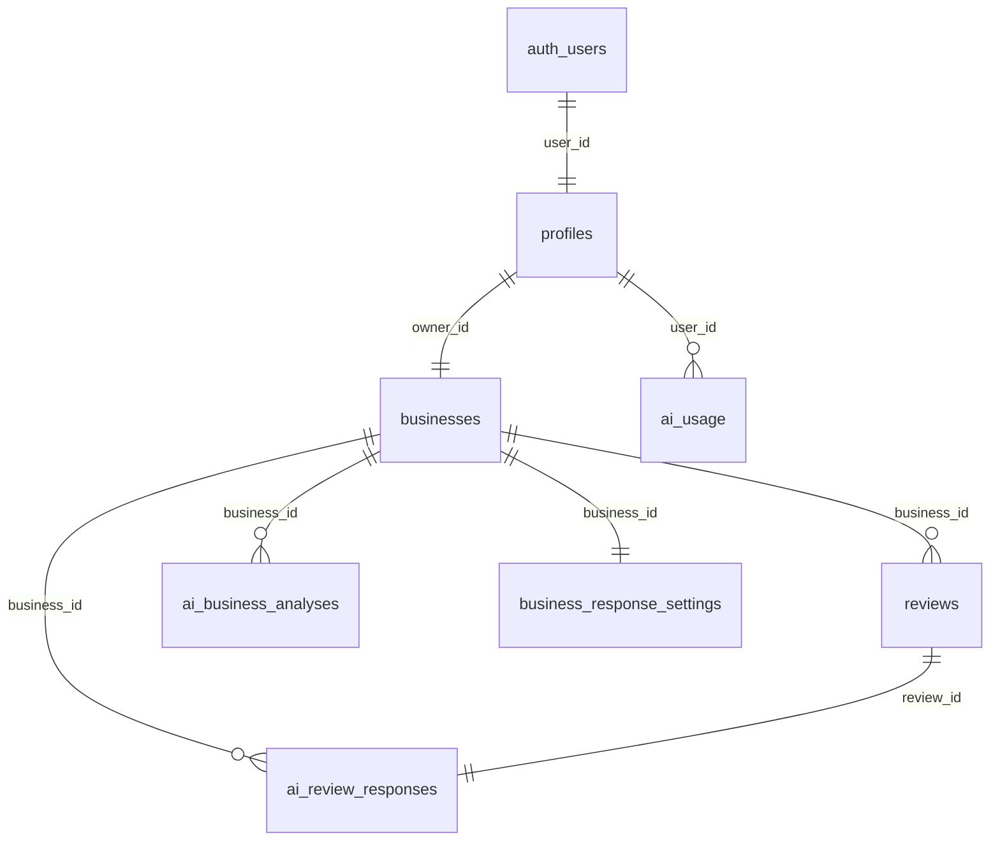

---
tags:
  - backend
  - database
  - development
  - supabase
---

# Supabase

Supabase obsługuje autoryzację, sesje i bazę danych NuvoRate.

## Klienci Supabase

- `lib/supabase/server.ts`: SSR, server components, actions i route handlers.
- `lib/supabase/client.ts`: klient browserowy auth.
- `lib/supabase/admin.ts`: service role, tylko server-side.
- `lib/supabase/middleware.ts`: odświeżanie sesji i ochrona tras.

## Tabele i funkcje

### `profiles`

Profil ownera powiązany z `auth.users`.

Kolumny: `user_id`, `full_name`, `plan`, `stripe_customer_id`, `stripe_subscription_id`, `subscription_status`, `current_period_end`, `created_at`, `updated_at`.

Wykorzystanie: auth flow, dashboard, Stripe webhook, checkout, portal billingowy, limity planów.

### `businesses`

Jedna firma przypisana do ownera.

Kolumny: `id`, `owner_id`, `name`, `industry`, `city`, `google_review_url`, `setup_status`, `created_at`, `updated_at`.

Wykorzystanie: onboarding, dashboard, reviews, responses, analysis, nfc, settings.

### `reviews`

Opinie klientów.

Kolumny: `id`, `business_id`, `author_name`, `rating`, `content`, `source`, `created_at`, `response_text`, `response_status`, `response_generated_at`.

Wykorzystanie: dashboard, `/reviews`, `/responses`, odpowiedzi OpenAI, analiza reputacji, wykres aktywności opinii.

### `ai_review_responses`

Wygenerowane odpowiedzi na opinie.

Kolumny: `id`, `business_id`, `review_id`, `response_text`, `model`, `created_at`, `updated_at`.

Wykorzystanie: dashboard i generator odpowiedzi. Aktualny kod synchronizuje także pola odpowiedzi bezpośrednio do `reviews`.

### `ai_business_analyses`

Analizy reputacji firmy.

Kolumny: `id`, `business_id`, `period_start`, `period_end`, `review_count`, `score`, `trend`, `summary`, `praised_elements`, `reported_problems`, `recommendations`, `model`, `created_at`, `updated_at`.

Wykorzystanie: `/dashboard`, `/analysis`, OpenAI.

### `ai_usage`

Miesięczne liczniki limitów.

Kolumny: `id`, `user_id`, `period_month`, `ai_replies_used`, `ai_analyses_used`, `created_at`, `updated_at`.

Unikalność: `user_id + period_month`.

### `business_response_settings`

Ustawienia odpowiedzi dla firmy.

Kolumny: `id`, `business_id`, `auto_generate`, `enabled_ratings`, `response_tone`, `created_at`, `updated_at`.

Wykorzystanie: `/responses` automatyczne odpowiedzi, `/settings` styl odpowiedzi, generator odpowiedzi OpenAI.

### `get_review_activity_trend(p_business_id, p_range)`

RPC z migracji `007_review_activity_trend.sql`.

Zwraca agregację opinii:

- `30d`: po dniach,
- `3m`: po tygodniach,
- `12m`: po miesiącach.

Wykorzystanie: wykres „Nowe opinie w czasie” na dashboardzie.

## Migracje

- `001_initial_schema.sql`: `profiles`, `businesses`.
- `002_reviews.sql`: `reviews`.
- `003_ai_features.sql`: `ai_review_responses`, `ai_business_analyses`.
- `004_business_analysis_score_trend.sql`: `score`, `trend`.
- `005_stripe_subscriptions.sql`: pola Stripe w `profiles`.
- `006_unpaid_plan_ai_usage.sql`: plan `unpaid`, `ai_usage`.
- `007_review_activity_trend.sql`: RPC trendu aktywności opinii.
- `008_review_responses.sql`: pola odpowiedzi w `reviews`, `business_response_settings`.
- `009_settings_fields.sql`: `business_response_settings.response_tone`.

## RLS

Owner może czytać i edytować własne dane. Operacje krytyczne, takie jak webhook Stripe i liczniki AI, używają service role po stronie server.

## Diagram danych

## Powiązane notatki

- [[Backend]]
- [[Server Actions]]
- [[Autoryzacja]]
- [[Stripe]]
- [[OpenAI]]
- [[Settings]]
